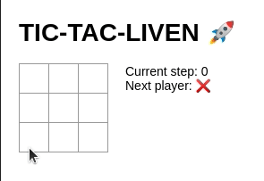

Projeto base disponível no CodeSandbox

# Introdução

TIC-TAC-LIVEN (Popularmente conhecido como o Jogo Da Velha) é um jogo simples que deve ser jogado por dois jogadores. O jogador que conseguir marcar 3 blocos na vertical, horizontal ou diagonal, é o vencedor.

É conhecido por ser um [Jogo Resolvido](https://pt.wikipedia.org/wiki/Jogo_resolvido). Ou seja, assumindo que os dois jogadores conheçam as regras e joguem perfeitamente, sempre teremos um empate.

# O desafio

_Exemplo de partida com vitória do jogador **X** no TIC-TAC-LIVEN funcionando normalmente_

Recentemente realizamos o lançamento da nossa versão do Jogo da Velha (TIC-TAC-LIVEN). Infelizmente, uma alteração posterior inseriu um bug indesejado na aplicação, ao mesmo tempo que recebemos feedbacks dos nossos jogadores que nos trouxeram insights de novas funcionalidades. Isso tudo somado à ausência de algumas boas práticas de qualidade (como testes automatizados) nos deixou diversos desafios para você solucionar. Sendo assim, o seu trabalho será dividido em 3 partes.

## 1. Consertar a implementação 🛠️

No momento, o jogo não está mais funcionando corretamente por causa de um bug relacionado ao gerenciamento de estado da aplicação. O seu desafio é **encontrar o bug e consertá-lo** de modo que as partidas voltem a funcionar, tanto para partidas com vencedores quanto empate.

Após a realização deste passo, esperamos que os jogadores possam realizar partidas no TIC-TAC-LIVEN normalmente, como nos GIFs.

## 2. Incremento de funcionalidades 🚩

O lançamento do **TIC-TAC-LIVEN** foi um grande sucesso! Os jogadores gostaram tanto que após apuração dos nossos POs, a funcionalidade mais requisitada foi a possibilidade de jogar novamente ao final de uma partida. Sendo assim, o seu desafio é **permitir que o usuário reinicie o tabuleiro** (caso ele deseje) assim que uma partida chegar ao fim*.* Lembrando que no TIC-TAC-LIVEN, cada rodada sempre alterna o jogador inicial (ou seja, se na rodada atual o ❌ iniciou a partida, na seguinte o ⭕ iniciará).

## 3. Qualidade de código e testes automatizados 🧪

Agora que teremos a nossa aplicação funcionando de volta, é muito importante reduzirmos a change de novos bugs surgirem em produção. Para este ponto, consideraremos a **adição de Typings corretos para análise estática da aplicação**, e **melhorar a implementação dos testes automatizados**, para garantir que a implementação da aplicação funciona em alguns cenários

Para auxiliar nesta implementação, seguem alguns casos de teste que queremos garantir:

- Partida com ❌ sendo vencedor
- Partida com ⭕ sendo vencedor
- Partida com empate
- Garantir que o estado do tabuleiro não muda ao clicar duas vezes em um mesmo bloco
- São bem vindos quaisquer outros testes que achar que podem adicionar valor

# Sobre a entrega

1. **Estimativa de tempo para entrega**: O primeiro ponto de entrega deste projeto é o próprio tempo de estimativa para a entrega final do projeto.
2. **Implementação**: O repositório deverá ser entregue para avaliação da estrutura do projeto. Por isso, quaisquer pontos de documentação/comentários em código são bem vindos, e o histórico de commits do GIT também será avaliado

**Boa sorte! 🍀**
